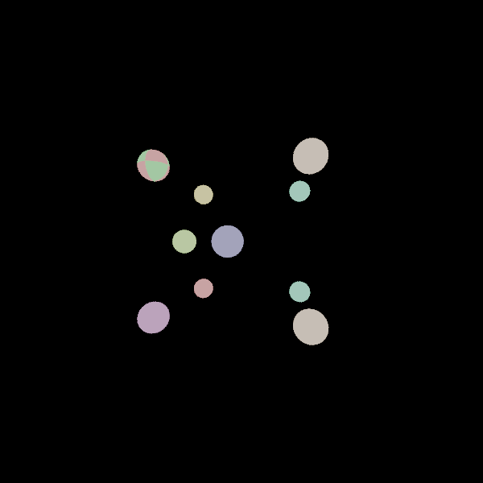
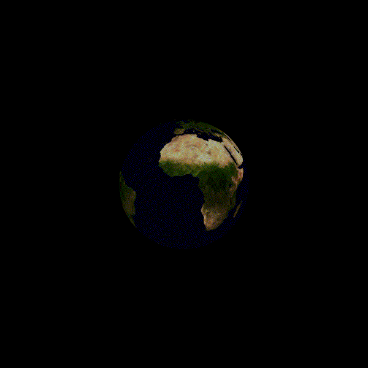

# PhotoNim - a CPU RayTracer written in Nim


# Installation
PhotoNim is available and tested for Linux, MacOSX and Windows machines.
To install it you can choose which approach you find the most fitting for you.

## Prerequisites
To use PhotoNim you must have installed the [Nim](https://github.com/nim-lang/Nim) programming language (version 2.0 or higher) on your machine.
To install the latest version on Unix you could run the following command:
```sh
curl https://nim-lang.org/choosenim/init.sh -sSf | sh
```
To install it on other OSs or to install previous versions, please refer to the [Nim installation guide](https://nim-lang.org/install.html).
Most of Nim installation already install the official Nim package manager [Nimble](https://github.com/nim-lang/nimble). You can verify it by running:
```sh
which nimble
```

### Installing from the repo
Choose the appropriate protocol (HTTPS or SSH) and clone the [PhotoNim repository](https://github.com/Negrini085/PhotoNim) using the command
```bash
git clone https://github.com/Negrini085/PhotoNim.git    # for HTTPS
git clone git@github.com:Negrini085/PhotoNim.git        # for SSH
```

### Installing from Tarball
Download the latest tarball from [here](https://github.com/Negrini085/PhotoNim/releases) and extract the tarball by running the command
```sh
tar -xzf PhotoNim-<version>.tar.gz
```

### Installing using Nimble
Install PhotoNim using nimble by running
```sh
nimble install PhotoNim
```

## Dependencies
PhotoNim depends on the following packages
- [docopt](https://github.com/docopt/docopt.nim) >= 0.6
- [nimPNG](https://github.com/jangko/nimPNG) >= 0.3

which can be installed using Nimble
```sh
cd PhotoNim && nimble install
```

Other dependencies are used to generate animations:
- [GNU Parallel](https://www.gnu.org/software/parallel/)
- [FFmpeg](https://ffmpeg.org/download.html)


# Usage

## PhotoNim CLI
To use PhotoNim CLI you will first need to build the project executable and you can do it from the root directory in different ways:
- using nimble build command
```sh
nimble build
```
- or explicitly compiling the source code
```sh
nim c -d:release PhotoNim.nim
```

Both these commands will generate an executable, called `PhotoNim` and located in the root directory.
You are now ready to use PhotoNim CLI: run the executable to see displayed the list of all commands
```sh
./PhotoNim
```
```sh
Usage:
    ./PhotoNim help [<command>]
    ./PhotoNim pfm2png <input> [<output>] [--a=<alpha> --g=<gamma> --lum=<avlum>]
```

### The `render` command

### The `pfm2png` command
Using the `pfm2png` command it is possible to convert an High Dynamic Range (HDR) image stored in a [PFM](https://www.pauldebevec.com/Research/HDR/PFM/) (Portable Float Map) format to an Low Dynamic Range (LDR) in the widely-used [PNG](https://en.wikipedia.org/wiki/PNG) (Portable Network Graphics) format. This conversion process involves the application of a tone mapping algorithm, a technique used to compresses the dynamic range while preserving important visual details. This process makes the HDR image viewable on standard displays without losing the essence of its high dynamic range.

```sh
./PhotoNim help pfm2png
```

```sh
PhotoNim CLI `pfm2png` command:

Usage:
    ./PhotoNim pfm2png <input> [<output>] [--a=<alpha> --g=<gamma> --lum=<avlum>]

Options:
    <input>             Path to the HDRImage to be converted from PFM to PNG.
    <output>            Path to the LDRImage. [default: "input_dir/" & "input_name" & "alpha_gamma" & ".png"]
    --a=<alpha>         Color renormalization factor. [default: 0.18]
    --g=<gamma>         Gamma correction factor. [default: 1.0]
    --lum=<avlum>       Average image luminosity.
```

For this example we will use the [memorial.pfm](https://www.pauldebevec.com/Research/HDR/PFM/) image and convert it with `pfm2png`:
```sh
wget https://www.pauldebevec.com/Research/HDR/memorial.pfm
./PhotoNim pfm2png memorial.pfm --a=0.30 --g=2.0
```
By varying the parameters alpha and gamma, you can produce visually different images without having to render them again:
|-| $\alpha = 0.15$ | $\alpha = 0.30$ | $\alpha = 0.45$ |
|--- | --- | --- | ---|
| $\gamma = 1.0$ |  |  |  |
| $\gamma = 2.0$ |  |  |  |


### The `help` command
You can use the `help` command to inspect a specific command helper screen:
```sh
./PhotoNim help demo
```

```sh
PhotoNim CLI `pfm2png` command:

Usage:
    ./PhotoNim pfm2png <input> [<output>] [--a=<alpha> --g=<gamma> --lum=<avLum>]

Options:
    <input>             Path to the HDRImage to be converted from PFM to PNG.
    <output>            Path to the LDRImage. [default: "input_dir/" & "input_name" & "alpha_gamma" & ".png"]
    --a=<alpha>         Color renormalization factor. [default: 0.18]
    --g=<gamma>         Gamma correction factor. [default: 1.0]
    --lum=<avLum>       Average image luminosity.
```

You can also use `help` without passing any command to see displayed the full PhotoNim CLI helper screen
(this works in the same ways as passing `(-h | --help)` flags).


## PhotoNim x Nimble tasks
You can try PhotoNim using Nimble by executing a specific nimble task from this list:
```sh
nimble tasks
```
```sh
build     Build the `PhotoNim` executable

demo      Run the `PhotoNim` demo

          Usage: 
                  nimble demo (persp | ortho) (OnOff | Flat | Path) <angle> [<output>] [<width> <height>]
          Options:
                  persp | ortho          Camera kind: Perspective or Orthogonal
                  OnOff | Flat | Path    Renderer kind: OnOff (only shows hit), Flat (flat renderer), Path (path tracer)

                  <angle>                Rotation angle around z axis. [default: 10]
                  <output>               Path to the LDRImage output. [default: "examples/demo/demo.png"]
                  <width>                Image width. [default: 900]
                  <height>               Image height. [default: 900]

demoAnim  Run the `PhotoNim` demo animation
examples  Run the `PhotoNim` examples
test      Run the `PhotoNim` tests
earth     Run the Earth animation
```

<table style="width:100%; border-collapse: collapse; text-align:center;">
  <thead>
    <tr>
      <th style="text-align:center;">demo persp OnOff 10</th>
      <th style="text-align:center;">demo persp Flat 10</th>
      <th style="text-align:center;">demo persp Path 10</th>
    </tr>
  </thead>
  <tbody>
    <tr>
      <td></td>
      <td></td>
      <td></td>
    </tr>
  </tbody>
</table>

<table style="width:100%; border-collapse: collapse; text-align:center;">
  <thead>
    <tr>
      <th style="text-align:center;">demoAnim</th>
      <th style="text-align:center;">earth</th>
    </tr>
  </thead>
  <tbody>
    <tr>
      <td></td>
      <td></td>
    </tr>
  </tbody>
</table>

# Contributing
If you want to contribute to the project, you can open a [pull requests](https://github.com/Negrini085/PhotoNim/pulls) or use the [issue tracker](https://github.com/Negrini085/PhotoNim/issues/) to suggest any code implementations or report bugs.
Any contributions are welcome!

# License
The code is released under the terms of the [GNU General Public License v3.0](https://www.gnu.org/licenses/gpl-3.0.html), see the [LICENSE](https://github.com/Negrini085/PhotoNim/blob/master/LICENSE).
