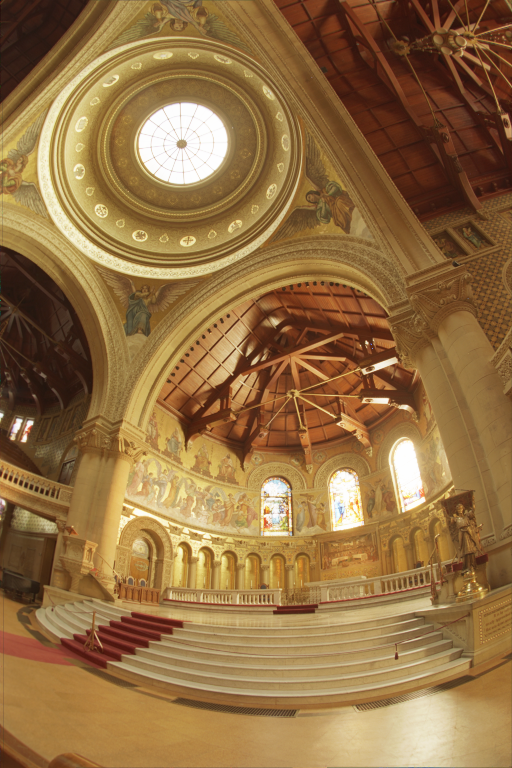
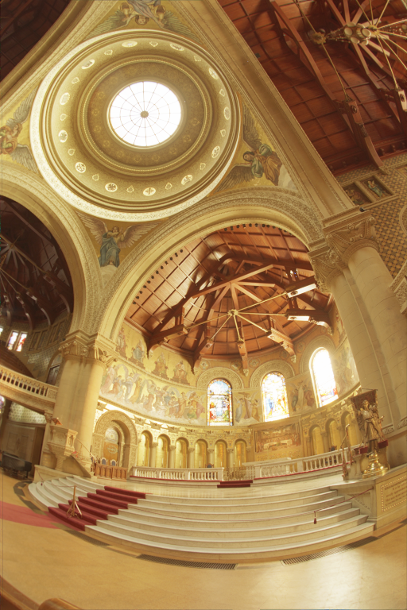

# PhotoNim CLI
To use PhotoNim CLI you will first need to build the project executable. \
You can do it from the root directory in different ways:
- using nimble build command
```sh
nimble build
```
- or explicitly compiling the source code
```sh
nim c -d:release PhotoNim.nim
```

Both these commands will generate an executable, called `PhotoNim` and located in the root directory. 
You are now ready to use PhotoNim CLI: run the executable to see displayed the list of all commands
```sh
./PhotoNim
```
```sh
Usage:
    ./PhotoNim help [<command>]
    ./PhotoNim pfm2png <input> [<output>] [--a=<alpha> --g=<gamma> --lum=<avlum>]
    ./PhotoNim demo (persp | ortho) [<output>] [--w=<width> --h=<height> --angle=<angle>]
```

### The `help` command
You can use the `help` command to inspect a specific command helper screen:
```sh
./PhotoNim help demo
```

```sh
PhotoNim CLI `demo` command:

Usage:
    ./PhotoNim demo (persp | ortho) [<output>] [--w=<width> --h=<height> --angle=<angle>]

Options:
    persp | ortho       Perspective or Orthogonal Camera kinds.
    <output>            Path to the output HDRImage. [default: "images/demo.pfm"]
    --w=<width>         Image width. [default: 1600]
    --h=<height>        Image height. [default: 900]
    --angle=<angle>     Rotation angle around z axis. [default: 10]
```

You can also use `help` without passing any command to see displayed the full PhotoNim CLI helper screen 
(this works in the same ways as passing `(-h | --help)` flags).

### The `pfm2png` command
Using the `pfm2png` command it is possible to convert an High Dynamic Range (HDR) image stored in a [PFM](https://www.pauldebevec.com/Research/HDR/PFM/) (Portable Float Map) format to an Low Dynamic Range (LDR) in the widely-used [PNG](https://en.wikipedia.org/wiki/PNG) (Portable Network Graphics) format. This conversion process involves the application of a tone mapping algorithm, a technique used to compresses the dynamic range while preserving important visual details. This process makes the HDR image viewable on standard displays without losing the essence of its high dynamic range.

```sh
./PhotoNim help pfm2png
```

```sh
PhotoNim CLI `pfm2png` command:

Usage: 
    ./PhotoNim pfm2png <input> [<output>] [--a=<alpha> --g=<gamma> --lum=<avlum>]

Options:
    <input>             Path to the HDRImage to be converted from PFM to PNG. 
    <output>            Path to the LDRImage. [default: "input_dir/" & "input_name" & "alpha_gamma" & ".png"]
    --a=<alpha>         Color renormalization factor. [default: 0.18]
    --g=<gamma>         Gamma correction factor. [default: 1.0]
    --lum=<avlum>       Average image luminosity. 
```


For this example we will use the [memorial.pfm](https://www.pauldebevec.com/Research/HDR/PFM/) image and convert it with `pfm2png`:
```sh
wget https://www.pauldebevec.com/Research/HDR/memorial.pfm
./PhotoNim pfm2png memorial.pfm --a=0.30 --g=2.0
```
By varying the parameters alpha and gamma, you can produce visually different images without having to render them again:
|-| $\alpha = 0.15$ | $\alpha = 0.30$ | $\alpha = 0.45$ |
|--- | --- | --- | ---|
| $\gamma = 1.0$ |  |  |  |
| $\gamma = 2.0$ |  |  |  |


### The `demo` command

### The `render` command